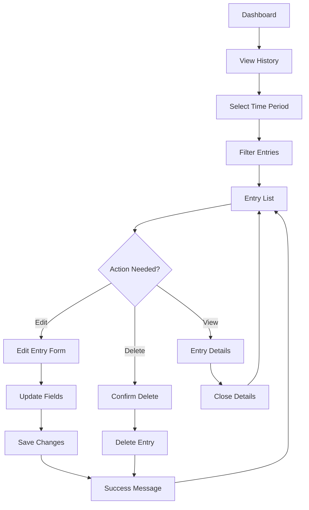

# 📐 Wireframes and User Flows
## Task Time Booking Application

### 🗺️ User Flow Diagrams

#### Primary User Flow: Quick Time Entry
```mermaid
flowchart TD
    A[App Launch] --> B{First Time User?}
    B -->|Yes| C[User Setup]
    B -->|No| D[Dashboard]
    C --> D
    D --> E[Scan Barcode Button]
    E --> F[Camera Opens]
    F --> G{Barcode Detected?}
    G -->|Yes| H[Auto-fill Work Order]
    G -->|No| I[Manual Entry Option]
    I --> J[Enter Work Order Manually]
    H --> K[Time Entry Form]
    J --> K
    K --> L[Set Start Time]
    L --> M[Set End Time]
    M --> N[Add Notes (Optional)]
    N --> O[Submit Entry]
    O --> P{Submission Success?}
    P -->|Yes| Q[Success Confirmation]
    P -->|No| R[Error Message]
    R --> S[Retry Option]
    S --> O
    Q --> T[Return to Dashboard]
```

#### Secondary User Flow: Review and Edit


### 📱 Mobile Wireframes

#### Dashboard/Home Screen
```
┌─────────────────────────────────────┐
│ ≡  Time Booking              👤    │ ← Header (64px)
├─────────────────────────────────────┤
│                                     │
│  Current Time: 2:30 PM              │ ← Status bar
│  📍 Location: Office                │
│                                     │
│  ┌─────────────────────────────────┐ │
│  │         📷                      │ │ ← Primary action
│  │    SCAN BARCODE                 │ │   (80px height)
│  │                                 │ │
│  └─────────────────────────────────┘ │
│                                     │
│  ┌─────────────────────────────────┐ │
│  │         ✏️                      │ │ ← Secondary action
│  │    MANUAL ENTRY                 │ │   (56px height)
│  └─────────────────────────────────┘ │
│                                     │
│  📋 Recent Entries                  │ ← Section header
│  ┌─────────────────────────────────┐ │
│  │ WO4320474        ✅ 2h 30m     │ │ ← Entry card
│  │ Electrical work                 │ │   (72px height)
│  │ 8:00 AM - 10:30 AM             │ │
│  └─────────────────────────────────┘ │
│  ┌─────────────────────────────────┐ │
│  │ WO4320475        ⏳ 1h 15m     │ │
│  │ HVAC maintenance                │ │
│  │ 11:00 AM - 12:15 PM            │ │
│  └─────────────────────────────────┘ │
│                                     │
│  📊 Today's Summary                 │
│  Total: 7h 30m | Entries: 3        │
│                                     │
├─────────────────────────────────────┤
│ 🏠    📋    📊    ⚙️              │ ← Bottom nav (64px)
│Home History Reports Settings       │
└─────────────────────────────────────┘
```

#### Barcode Scanner Screen
```
┌─────────────────────────────────────┐
│ ✕                           💡     │ ← Controls overlay
│                                     │
│                                     │
│                                     │
│        ┌─────────────────┐          │
│        │                 │          │ ← Scan frame
│        │                 │          │   (200x200px)
│        │       📷        │          │
│        │                 │          │
│        └─────────────────┘          │
│                                     │
│     Point camera at barcode         │ ← Instructions
│                                     │
│                                     │
│                                     │
│                                     │
│                                     │
│  ┌─────────────────────────────────┐ │
│  │      📝 Manual Entry            │ │ ← Fallback option
│  └─────────────────────────────────┘ │
│                                     │
│  🔦 Tap to toggle flashlight        │ ← Helper text
└─────────────────────────────────────┘
```

#### Time Entry Form
```
┌─────────────────────────────────────┐
│ ←  Time Entry                   💾  │ ← Header with save
├─────────────────────────────────────┤
│                                     │
│ Work Order *                        │ ← Required field
│ ┌─────────────────────────────────┐ │
│ │ WO4320474                       │ │ ← Pre-filled from scan
│ └─────────────────────────────────┘ │
│                                     │
│ Description                         │
│ ┌─────────────────────────────────┐ │
│ │ Electrical maintenance          │ │ ← Auto-populated
│ └─────────────────────────────────┘ │
│                                     │
│ Start Time *                        │
│ ┌─────────────────────────────────┐ │
│ │ 08:00 AM            📅         │ │ ← Time picker
│ └─────────────────────────────────┘ │
│                                     │
│ End Time *                          │
│ ┌─────────────────────────────────┐ │
│ │ 10:30 AM            📅         │ │
│ └─────────────────────────────────┘ │
│                                     │
│ ⏱️ Duration: 2h 30m                │ ← Calculated
│                                     │
│ Notes (Optional)                    │
│ ┌─────────────────────────────────┐ │
│ │                                 │ │ ← Text area
│ │                                 │ │   (80px height)
│ └─────────────────────────────────┘ │
│                                     │
│ ┌─────────────────────────────────┐ │
│ │        SUBMIT ENTRY             │ │ ← Primary action
│ └─────────────────────────────────┘ │
│                                     │
│ 💾 Save Draft                       │ ← Secondary action
└─────────────────────────────────────┘
```

### 🖥️ Desktop Wireframes

#### Dashboard Layout
```
┌─────────────────────────────────────────────────────────────────────┐
│ ≡ Time Booking                                            👤 Profile │ ← Header
├─────────────────────────────────────────────────────────────────────┤
│                                                                     │
│ ┌─────────────────┐  ┌─────────────────────────────────────────────┐ │
│ │ Quick Actions   │  │ Recent Entries                              │ │
│ │                 │  │                                             │ │
│ │ 📷 Scan Barcode │  │ ┌─────────────────────────────────────────┐ │ │
│ │                 │  │ │ WO4320474  ✅  2h 30m  Edit | Delete   │ │ │
│ │ ✏️ Manual Entry │  │ │ Electrical work                         │ │ │
│ │                 │  │ │ Jul 3, 8:00 AM - 10:30 AM             │ │ │
│ │ 📋 View History │  │ └─────────────────────────────────────────┘ │ │
│ │                 │  │                                             │ │
│ │ 📊 Reports      │  │ ┌─────────────────────────────────────────┐ │ │
│ └─────────────────┘  │ │ WO4320475  ⏳  1h 15m  Edit | Delete   │ │ │
│                      │ │ HVAC maintenance                        │ │ │
│ ┌─────────────────┐  │ │ Jul 3, 11:00 AM - 12:15 PM            │ │ │
│ │ Today's Summary │  │ └─────────────────────────────────────────┘ │ │
│ │                 │  │                                             │ │
│ │ Total: 7h 30m   │  │ View All →                                  │ │
│ │ Entries: 3      │  └─────────────────────────────────────────────┘ │
│ │ Avg: 2h 30m     │                                                  │
│ └─────────────────┘                                                  │
│                                                                     │
└─────────────────────────────────────────────────────────────────────┘
```

### 🎨 Component Specifications

#### Button Specifications
```
Primary Button:
- Height: 48px (mobile), 40px (desktop)
- Padding: 16px horizontal, 12px vertical
- Border radius: 6px
- Font: 16px medium weight
- Min touch target: 44x44px

Secondary Button:
- Same dimensions as primary
- Border: 1px solid gray-300
- Background: white
- Text: gray-700

Icon Button:
- Size: 44x44px (minimum touch target)
- Border radius: 6px
- Icon size: 20x20px
```

#### Input Field Specifications
```
Text Input:
- Height: 48px (mobile), 40px (desktop)
- Padding: 12px horizontal
- Border: 1px solid gray-300
- Border radius: 6px
- Font: 16px regular
- Focus: 2px blue ring, blue border

Label:
- Font: 14px medium weight
- Color: gray-700
- Margin bottom: 8px

Error Message:
- Font: 14px regular
- Color: red-600
- Margin top: 4px
```

#### Card Specifications
```
Standard Card:
- Background: white
- Border: 1px solid gray-200
- Border radius: 8px
- Shadow: 0 2px 8px rgba(0,0,0,0.08)
- Padding: 24px

Compact Card:
- Same styling as standard
- Padding: 16px

Interactive Card:
- Hover: shadow increases to medium
- Focus: 2px blue ring
- Cursor: pointer
```

### 📐 Layout Grid System

#### Mobile Layout (320px - 767px)
```
Margins: 16px
Gutters: 8px
Columns: 4 (flexible)
Max width: 100%
```

#### Tablet Layout (768px - 1023px)
```
Margins: 24px
Gutters: 16px
Columns: 8
Max width: 100%
```

#### Desktop Layout (1024px+)
```
Margins: 32px
Gutters: 24px
Columns: 12
Max width: 1200px
Container: centered
```

### 🎯 Accessibility Specifications

#### Touch Targets
- Minimum size: 44x44px
- Recommended spacing: 8px between targets
- Thumb-friendly placement on mobile

#### Color Contrast
- Normal text: 4.5:1 minimum
- Large text: 3:1 minimum
- Interactive elements: 3:1 minimum

#### Focus Management
- Visible focus indicators
- Logical tab order
- Skip links for main content
- Escape key closes modals

#### Screen Reader Support
- Semantic HTML structure
- ARIA labels for complex interactions
- Alt text for images
- Form labels properly associated

This wireframe specification provides a comprehensive foundation for implementing the time booking application with consistent, accessible, and user-friendly interfaces across all devices.
